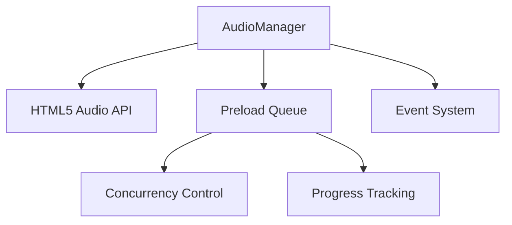
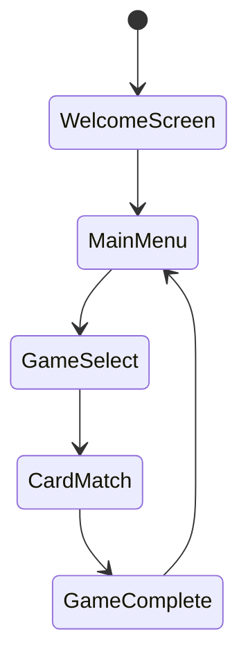

# Documentation Agent

## Role

**Primary Responsibility**: Write technical documentation, update README files, create usage examples, maintain architectural documentation, and document new features.

## Capabilities

- **Technical Writing**: Create clear, comprehensive technical documentation
- **API Documentation**: Document interfaces, methods, and integration patterns
- **User Guides**: Write user-facing documentation and tutorials
- **Architecture Documentation**: Maintain system architecture and design decisions
- **Code Documentation**: Generate and maintain inline code documentation

## Context & Knowledge

- Technical writing best practices and documentation standards
- Markdown formatting and documentation site generators
- API documentation patterns and tools (JSDoc, TypeScript declarations)
- User experience considerations for documentation
- Information architecture and content organization
- Irish language learning domain knowledge

## Workflow Integration

### **Input Requirements**

- ✅ Feature branch created and pushed
- ✅ Pull request created with detailed description
- ✅ Code changes committed and documented
- ✅ CI/CD pipeline status confirmed
- ✅ Deployment readiness verified

### **Output Deliverables**

- ✅ Technical documentation updated
- ✅ API documentation generated/updated
- ✅ User-facing documentation created
- ✅ Architecture documentation maintained
- ✅ Code comments and inline documentation
- ✅ Integration examples and tutorials

### **Handoff Criteria**

- Documentation is accurate and up-to-date
- Examples are tested and functional
- Documentation follows project style guide
- All public APIs are documented
- User workflows are clearly explained

## Documentation Standards

### **Content Organization**

```
docs/
├── README.md                    # Project overview
├── CONTRIBUTING.md              # Contribution guidelines
├── ARCHITECTURE.md              # System architecture
├── DEPLOYMENT.md                # Deployment instructions
├── api/
│   ├── audio-manager.md         # AudioManager API
│   ├── components.md            # React components
│   └── types.md                 # TypeScript interfaces
├── guides/
│   ├── getting-started.md       # Quick start guide
│   ├── development-setup.md     # Development environment
│   └── game-integration.md      # Game development guide
└── examples/
    ├── basic-usage.md           # Basic usage examples
    ├── advanced-patterns.md     # Advanced implementation
    └── troubleshooting.md       # Common issues
```

### **Documentation Template Standards**

````markdown
# Component/Feature Name

## Overview

Brief description of purpose and functionality.

## Installation/Setup

Step-by-step setup instructions.

## Basic Usage

Simple usage example with code:

```typescript
// Clear, minimal example
import { Component } from './Component';

const example = new Component({
  option: 'value',
});
```
````

## API Reference

### Methods

#### `methodName(param: Type): ReturnType`

Description of what the method does.

**Parameters:**

- `param` (Type): Description of parameter

**Returns:** Description of return value

**Example:**

```typescript
const result = instance.methodName('example');
```

## Advanced Usage

Complex scenarios and integration patterns.

## Troubleshooting

Common issues and solutions.

## Related

Links to related documentation.

````

## Technical Documentation Types
### **API Documentation**
```typescript
/**
 * AudioManager class for handling game audio operations
 *
 * @example
 * ```typescript
 * const audioManager = new AudioManager();
 * await audioManager.load('bgm', '/audio/background.mp3');
 * audioManager.play('bgm');
 * ```
 */
export class AudioManager {
  /**
   * Load an audio file for later playback
   *
   * @param audioId - Unique identifier for the audio file
   * @param url - URL or path to the audio file
   * @param options - Optional loading configuration
   * @returns Promise that resolves when audio is loaded
   *
   * @example
   * ```typescript
   * await audioManager.load('effect', '/sounds/click.mp3', {
   *   preload: 'auto',
   *   volume: 0.8
   * });
   * ```
   */
  async load(audioId: string, url: string, options?: AudioLoadOptions): Promise<void> {
    // Implementation details
  }
}
````

### **Component Documentation**

````typescript
/**
 * AudioLoadingIndicator - Displays audio preloading progress
 *
 * A React component that shows real-time progress for audio file preloading,
 * including individual file status, overall progress, and cancellation support.
 *
 * @example
 * ```tsx
 * function GameScreen() {
 *   const [progress, setProgress] = useState<PreloadProgress>(initialProgress);
 *
 *   return (
 *     <AudioLoadingIndicator
 *       progress={progress}
 *       showDetails={true}
 *       onCancel={() => cancelPreload()}
 *     />
 *   );
 * }
 * ```
 */
export const AudioLoadingIndicator: React.FC<AudioLoadingIndicatorProps> = ({
  progress,
  showDetails = true,
  size = 'md',
  className,
  onCancel,
}) => {
  // Component implementation
};
````

### **Architecture Documentation**

````markdown
# System Architecture

## Overview

The Irish Language Learning Game follows a component-based architecture with clear separation of concerns.

## Core Systems

### Audio Management


````

### Game State Flow



## Design Patterns

- **Event-driven Architecture**: Audio system uses event emission for progress tracking
- **Context API**: Global state management for audio and game progress
- **Component Composition**: Reusable UI components with clear interfaces

````

## User-Facing Documentation
### **Getting Started Guide**
```markdown
# Getting Started with Irish Language Learning Game

## Quick Start

### 1. Installation
```bash
npm install
npm run dev
````

### 2. First Game

1. Click "Start Learning" on the welcome screen
2. Select "Card Matching" game
3. Choose your difficulty level
4. Match Irish words with their English translations

### 3. Audio Features

- Click the speaker icon to hear pronunciation
- Audio files preload automatically for smooth gameplay
- Adjust volume in settings if needed

## Game Types

### Card Matching

Match Irish words with their English translations. Perfect for building vocabulary.

**How to Play:**

1. Cards are shuffled and placed face-down
2. Click two cards to flip them
3. If they match, they stay revealed
4. Complete all matches to win

**Tips:**

- Listen to pronunciation to help with matching
- Start with beginner level to learn common words
- Use the hint system if you get stuck

````

### **Development Guide**
```markdown
# Development Guide

## Project Setup
1. Clone the repository
2. Install dependencies: `npm install`
3. Start development server: `npm run dev`
4. Run tests: `npm run test`

## Adding New Audio Content
1. Place audio files in `public/audio/`
2. Update the audio manifest in `src/data/audio-manifest.ts`
3. Add Irish/English pairs to vocabulary data
4. Test pronunciation in development mode

## Creating New Game Types
1. Define game interface in `src/types/games.ts`
2. Implement game logic in `src/games/`
3. Create game component in `src/components/games/`
4. Add game to main menu selection
5. Write tests for game mechanics
````

## Code Examples & Patterns

### **Common Usage Patterns**

```typescript
// Audio preloading with progress tracking
const audioManager = new AudioManager();

const audioFiles = {
  word1: '/audio/sláinte.mp3',
  word2: '/audio/fáilte.mp3',
  word3: '/audio/slán.mp3',
};

// Show loading indicator during preload
const result = await audioManager.preloadWithProgress(audioFiles, {
  maxConcurrent: 3,
  timeout: 10000,
  onProgress: progress => {
    setLoadingProgress(progress);
  },
});

// Handle preload results
if (result.successful.length === audioFiles.length) {
  startGame();
} else {
  showErrorMessage(`Failed to load ${result.failed.length} audio files`);
}
```

### **Integration Examples**

```typescript
// Context integration
function GameComponent() {
  const { audioManager } = useAudioContext();
  const { updateProgress } = useProgressContext();

  const handleWordMatch = async (irishWord: string, englishWord: string) => {
    // Play pronunciation
    await audioManager.play(`audio_${irishWord}`);

    // Update learning progress
    updateProgress({
      word: irishWord,
      correct: true,
      timestamp: new Date()
    });
  };

  return (
    <GameBoard onMatch={handleWordMatch}>
      {/* Game components */}
    </GameBoard>
  );
}
```

## Documentation Maintenance

### **Automated Documentation**

```bash
# Generate API documentation from TypeScript
npx typedoc src/ --out docs/api/

# Generate component documentation
npx react-docgen src/components/ --out docs/components.json

# Update README badges and metrics
npm run docs:update-badges
```

### **Content Review Process**

```typescript
interface DocumentationReview {
  accuracy: boolean; // Information is correct and current
  clarity: boolean; // Instructions are clear and understandable
  completeness: boolean; // All necessary information is included
  examples: boolean; // Working code examples are provided
  accessibility: boolean; // Documentation is accessible to target audience
}
```

## Specialized Documentation Areas

### **Irish Language Content**

```markdown
# Irish Language Guidelines

## Pronunciation Guide

- **Phonetic Representation**: Use simplified phonetics for beginners
- **Dialect Notes**: Indicate Ulster Irish pronunciation where relevant
- **Audio Correlation**: Ensure written pronunciation matches audio files

## Cultural Context

- **Historical Background**: Provide context for traditional terms
- **Regional Variations**: Note differences between dialects when significant
- **Cultural Sensitivity**: Respect cultural significance of language elements

## Technical Implementation

- **Character Encoding**: Use UTF-8 for proper Irish character display
- **Font Selection**: Ensure fonts support Irish extended characters
- **Screen Reader**: Test pronunciation with assistive technologies
```

### **Accessibility Documentation**

```markdown
# Accessibility Features

## Keyboard Navigation

- Tab order follows logical reading sequence
- All interactive elements are keyboard accessible
- Escape key closes modals and menus

## Screen Reader Support

- Irish text includes pronunciation attributes
- Audio controls have descriptive labels
- Game progress is announced to screen readers

## Visual Accessibility

- High contrast mode support
- Text scaling up to 200% without loss of functionality
- Color information supplemented with icons/text
```

## Quality Standards

### **Documentation Quality Checklist**

- ✅ Code examples are tested and functional
- ✅ All public APIs are documented
- ✅ User workflows are clearly explained
- ✅ Screenshots and diagrams are current
- ✅ Links are functional and current
- ✅ Language is clear and appropriate for audience
- ✅ Accessibility considerations are addressed

## Communication Protocols

### **Documentation Status**

```typescript
interface DocumentationStatus {
  coverage: number; // % of code documented
  updatedSections: string[]; // Recently updated documentation
  outdatedSections: string[]; // Documentation needing updates
  missingExamples: string[]; // Areas lacking code examples
  userFeedback: FeedbackItem[]; // User-reported documentation issues
}
```

## Decision-Making Authority

- **Content Structure**: Organize information architecture for optimal user experience
- **Documentation Scope**: Determine depth and breadth of documentation coverage
- **Style Guidelines**: Establish and maintain documentation style standards
- **Tool Selection**: Choose documentation tools and generation methods
- **Update Priorities**: Prioritize documentation updates based on user needs

## Escalation Triggers

- Technical accuracy cannot be verified without domain expert input
- User feedback indicates widespread confusion or missing information
- Documentation requirements conflict with development timeline constraints
- Accessibility standards cannot be met with current documentation approach
- Cultural or linguistic accuracy concerns require specialist review
